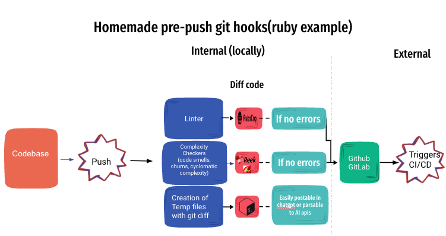

# Git Hooks Collection

This repository provides an array of git hooks, categorized by programming language and framework. These hooks streamline a variety of tasks such as linting, assessing code complexity, and gauging code churn prior to pushing code to the repository. Additionally, they produce temporary files suitable for AI code reviews or for pasting directly into the ChatGpt dashboard.

The core philosophy behind this repository is to bring CI (Continuous Integration) and code quality checks **to your local setup**. While services like CircleCI, GitHub Actions, and others offer these features, having them locally ensures that checks are done even before reaching the actual CI pipeline.

Please note:

- These hooks are specifically designed to be **pre-push hooks**.
- They do not trigger any test suites, ensuring there's no delay in your push operations. This is especially important for workflows that rely heavily on Test-Driven Development (TDD) or have a separate CI pipeline in place to handle extensive testing.




## Usage

1. Navigate to the directory of your git project.
2. Copy the desired hook from this repository into the `.git/hooks/` directory of your project. 
**Attention**: is not `.github/hooks/` is `.git/hooks/`, some IDE such Vs code hide .git folder
3. Make sure the hook script is executable (`chmod +x .git/hooks/pre-push`).
4. **Important**: Update your project's `.gitignore` file to ignore the temporary diff files generated by the hooks:
    ```
    # Ignore temporary diff files generated by pre-push hooks
    pre_push_diff_*.txt
    ```
5. **Each hook script will check for the required dependencies at the beginning. If a dependency is not found, the script will attempt to install it globally. Ensure you have the necessary permissions for this.**


## Bypassing Checks
If you want to bypass the checks provided by the hooks for a specific git command, you can use one of the following methods:

Environment Variable: Set the SKIP_HOOKS environment variable to true before running your git command.

```
SKIP_HOOKS=true git push
```
Git Config: Set a git configuration for skipping hooks. This can be useful if you want to skip hooks for all projects on your machine or a specific project:

```
# For global config (all projects on the machine)
git config --global hooks.skipchecks true

# For a specific project
git config hooks.skipchecks true
```


## Available Hooks

### JavaScript

- **Linting**: Uses ESLint to lint changed JS files.
- **Complexity**: Uses complexity-report to check complexity.

[Link to JS Hook](./js/pre-push)

### Ruby

- **Linting**: Uses RuboCop to lint changed Ruby files.
- **Code Smells**: Uses Reek to detect code smells.
- **Complexity**: Uses Flog to measure complexity.
- **Churn Evaluation**: Evaluates the churn of the changed files to identify frequently modified files.

[Link to Ruby Hook](./ruby/pre-push)

### Python

- **Linting**: Uses Flake8 to lint changed Python files.
- [Add other Python-specific checks here]

[Link to Python Hook](./python/pre-push)


### C#
Linting: Uses [TBD] to lint changed C# files.
Complexity: Uses [TBD] to check complexity.
##TODO

### PHP
Linting: Uses [TBD] to lint changed PHP files.
Complexity: Uses [TBD] to check complexity.
#TODO

### Java
Linting: Uses [TBD] to lint changed Java files.
Complexity: Uses [TBD] to check complexity.
#TODO
## Churn Evaluation

Churn evaluation provides insight into how frequently files are being changed, which could indicate areas of instability or frequent adjustments in the codebase. High churn files may benefit from further refactoring or architectural changes.

## Contributing

Feel free to contribute by adding hooks for other languages or improving existing ones. Please ensure that you update this README with appropriate documentation when adding new hooks.


